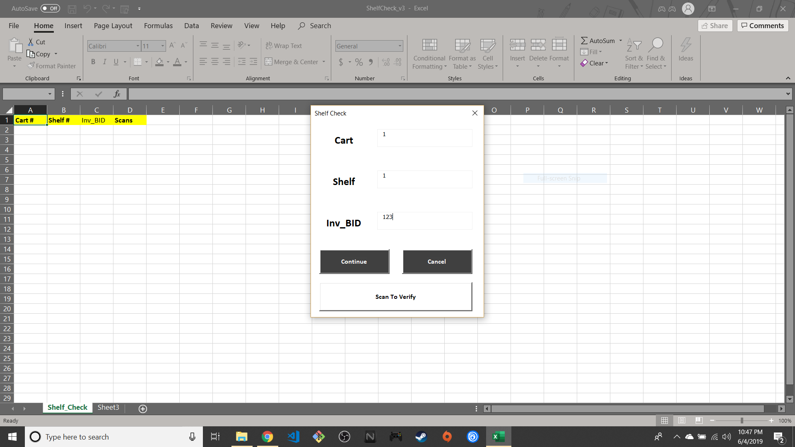
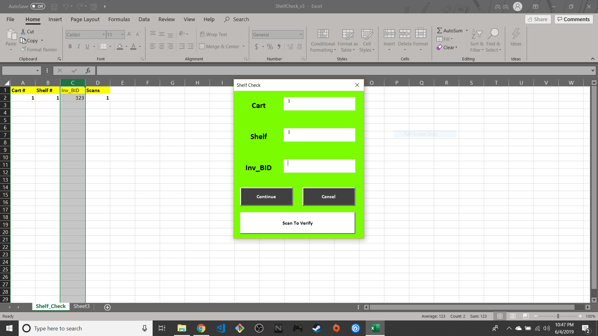
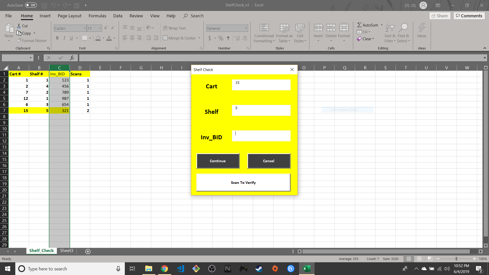
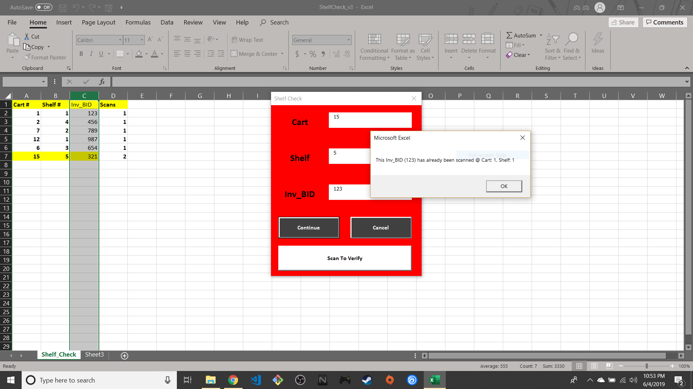
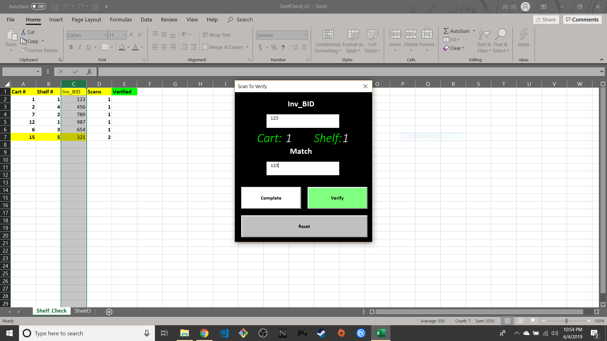
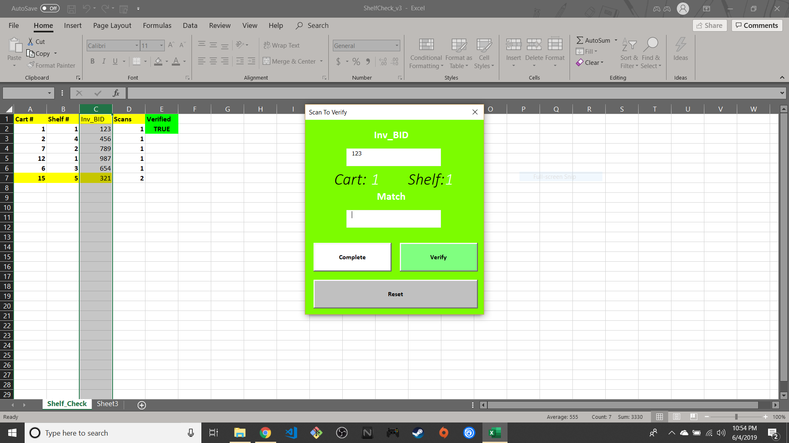
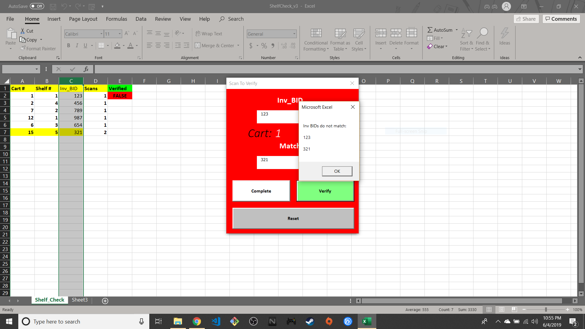

This repository features a project that was originally a part of a different repository, which featured both "TemplateMacro" and "ShelfCheck". Both projects were completed in May of 2019, but were separated into two distinct repos as a part of a GitHub refactoring in June 2020.
                      
# ShelfCheck_v3:

- The purpose of this macro is to provide a way for workers to record, identify, and rearrange the location of seed containers. Each container has a barcode identifying the "kind" of seed within the container. Once scanned, the macro will record the Cart and Shelf location of the seed and its container.

- In some cases, seed can be distributed between multiple containers and thus more than one container can have the same barcode. The macro is designed to notify the user if the same bar code has been scanned more than once. How exactly the macro functions upon a duplicate scan depends on the situation.

    *If a barcode has been scanned more than once, but it was scanned with to the same location (Cart/Shelf) as a previous scan, the macro will simply highlight the row and share an innocuous audible cue to the user. This informs the user of the duplicate scan while allowing the user to continue scanning for other containers. It is up to the user whether or not they want to address the duplicate scan.
    
    *If a barcode has been scanned more than once, but the location is different, the macro will change the userform's color to red and share an audible error cue. Then, the macro initiates a second userform that will prompt the user to scan both the duplicate barcode and its original to verify whether or not they are truly the same. This is done because workers will likely move and/or combine all duplicate containers to/with its original.
    
# DEMONSTRATION:

# BEFORE SCANNING

# AFTER NORMAL SCAN

# AFTER DUPLICATE SCAN (SAME LOCATION)

# AFTER DUPLICATE SCAN (DIFFERENT LOCATION)

# BEFORE VERIFYING BARCODES

# AFTER VERIFICATION

# AFTER VERIFICATION FAILS

    

## HOW TO USE THE MACRO

### WARNING 
__Once macros are run, Excel does not allow reverting any changes made to worksheets.__                               

- Click on the ShelfCheck "xlsm" file within the "demo" folder.
- Find and click the "Download" button for the "xlsm" file.
- Open the Excel file and enable editing and macros, when prompted.
- Locate the "customize quick access toolbar" on the upper left-hand corner of the Excel window
- Click the "customize quick access toolbar" button and select "More commands..."
- Scroll down the large leftward selection box until finding the "View Macros" icon.
- Add the "View Macros" icon to rightward selection box by clicking it then pressing "Add".
- Once the button is added, select "Ok" at the bottom of the customization window.
- Click the newly added "View Macros" icon located near the "customize quick access toolbar" button.
- Select the macro "Shelf_Check".
        
Because the Shelf_Check macro will create a new worksheet, simply delete the "Shelf_Check" sheet
to reset demo with a fresh worksheet.
